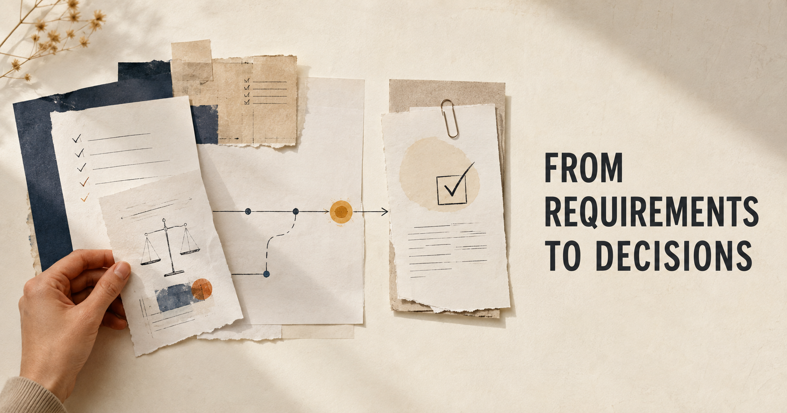

# Operational AI Governance and Compliance Readiness File
## A simulated deployer-side assessment of a high-risk employment AI system under the EU AI Act

> **SIMULATION NOTICE.** Everything in this repository is **fictional**,
> created for portfolio and educational purposes. "TalentSift B.V." and
> "Modaretti S.p.A." do not exist. Nothing here is legal advice. Nothing here
> states or implies that any party is legally compliant, certified, or
> conformity-assessed.

This portfolio project was developed by an early-career AI governance
professional whose MA research focused on the EU AI Act and human rights due
diligence for high-risk employment AI. It demonstrates the operationalisation
of AI governance through legal classification, risk assessment, rights-impact
analysis, vendor due diligence and a documented deployment decision.

The author defined the governance approach, reviewed and approved the legal
analysis, made the risk-acceptance and deployment judgments, and approved the
final governance conclusions. AI tools supported document structuring,
preliminary drafting, consistency checks and file organisation.

## The story in one line

**Case → Classification → Risk → Rights assessment → Vendor gaps →
Conditional deployment decision.**

A fictional Italian retailer (Modaretti, ~2,800 employees) screens
30,000–40,000 job applications a year with a fictional Dutch vendor's AI
ranking tool (TalentSift Recruit). This file works that deployment end to
end, the way a deployer-side governance function would: classify it, register
its risks, assess its impact on people's rights, interrogate the vendor, and
reach a documented deployment decision.

## Start here — the five core outputs

1. **[The case](case/case-definition.md)** — the fictional company, system,
   and decision flow, plus a frozen six-document
   [evidence pack](case/evidence/evidence-index.md) the analysis is locked to.
2. **[Applicability & classification assessment](artifacts/01-applicability/applicability-assessment-completed.md)**
   — AI system under Art. 3(1); no prohibited practice (Art. 5); **high-risk
   under Annex III 4(a)** with the Art. 6(3) derogation defeated by a worked
   profiling analysis; provider/deployer roles; and the timeline done
   honestly: what binds now (GDPR, Art. 5) versus what applies from
   2 December 2027.
3. **[Risk register](artifacts/02-inventory-risk-register/risk-register.md)**
   — 14 risks in which harm to people is never collapsed into harm to the
   organisation, with a recorded governance outcome and a post-vendor status
   update.
4. **[Voluntary FRIA-Plus assessment](artifacts/03-fria-plus/fria-plus-completed.md)**
   — the author's thesis-derived rights-impact framework, applied. Its first
   finding is legal honesty: Art. 27 does **not** oblige a private retailer
   to conduct a FRIA — this one is voluntary, and that is the argument.
5. **[Vendor assessment — completed](artifacts/04-vendor-questionnaire/vendor-questionnaire-talentsift-responses.md)**
   — 38 gap-targeted questions and the vendor's simulated responses: six red
   flags, four of six renewal conditions unmet as answered.

## Executive governance decision

> **Conditional continuation under interim safeguards; full compliance
> readiness has not been established.**

Recorded decision (FRIA-Plus §5): the system may be used **only as decision
support or triage** — no applicant may be rejected, archived, or sent an
adverse notification solely on the system's output without documented,
meaningful human review. Automatic rejection is retired for the current
deployment; any reintroduction would be a new governance decision on new
evidence. Immediate safeguards run on fixed deadlines (human-review
procedure, corrected candidate notice, contestability route, DPIA), and the
vendor-dependent evidence gaps — disaggregated bias testing, Italian-market
validation, decision logging, update notification, real documentation, real
audit rights — are conditions of the October 2026 contract renewal. If they
are not met, use moves automatically to a restricted, non-adverse mode, with
pause as the next step. A documented deadline is not itself evidence that a
control is operating; control status is tracked from *proposed* through
*implemented* and *tested* to *shown effective*.

## Optional: reusable templates

- [Applicability & classification template](artifacts/01-applicability/applicability-assessment-template.md)
- [FRIA-Plus template](artifacts/03-fria-plus/fria-plus-template.md)
- [Vendor questionnaire](artifacts/04-vendor-questionnaire/vendor-questionnaire.md)
  (reusable by replacing the case-specific motivation column)
- [AI inventory structure](artifacts/02-inventory-risk-register/ai-inventory.md)

To adapt them: build and freeze your evidence base first; keep the claim
taxonomy; re-verify every legal citation against EUR-Lex at your own date;
present the FRIA-Plus additions as voluntary practice, never as legal
requirements; and give every control a named owner and an effectiveness test
someone can actually run.

## Supporting documentation (methodology)

- [Evidence rules](methodology/evidence-rules.md) — the eight-category claim
  taxonomy (CASE FACT, EXTERNAL LEGAL SOURCE, VENDOR CLAIM, ANALYST
  INTERPRETATION, ASSUMPTION, EVIDENCE GAP, RECOMMENDATION, USER DECISION);
  vendor claims are never promoted to facts.
- [Source register](methodology/source-register.md) — five-tier source
  hierarchy; official EU sources are authoritative. Central AI Act provisions
  were verified against the Official Journal text of Regulation (EU)
  2024/1689 (EUR-Lex), and the Digital Omnibus amendments against the adopted
  final text PE-CONS 30/26 (Council public register).
- [Legal-status register](methodology/legal-status-register.md) — what is in
  force, not yet applicable, adopted-but-unpublished, guidance, voluntary
  standard, or (like FRIA-Plus itself) a thesis framework with no legal
  status.
- [Review checklist](methodology/review-checklist.md) and
  [assumptions & unknowns register](methodology/assumptions-and-unknowns.md).

Drafting was AI-assisted; every artifact passed the project owner's review,
with corrections recorded by decision ID (D-xx) in an internal development
log.

## Known limitations (read before relying on anything)

- Legal statuses are stated **as of 13 July 2026**. The Digital Omnibus
  (PE-CONS 30/26) was adopted but **not yet published in the Official
  Journal, and not in force**, on that date — re-verify before reuse.
- GDPR analysis (esp. Art. 22) is framed as a **prima facie** exposure
  requiring a dedicated DPIA-level assessment; no breach conclusion is made.
- The vendor's headline performance claim is assessed as **not independently
  interpretable** (undisclosed task, dataset, threshold, model version) —
  a metric-transparency finding, not a numerical contradiction.
- The vendor validation evidence is classified **CURRENT APPLICABILITY NOT
  DEMONSTRATED** after two undisclosed scoring updates — not automatically
  invalid.
- ISO/IEC 42001 references are **thematic alignment only — clause-level
  verification pending**; no conformity or certification is implied.
- Italian labour-law duties (Transparency Decree) are flagged
  **[unverified]** — in a real case, a priority question for Italian
  employment counsel.
- Commission guidelines (Art. 3(1), Art. 5) are cited at heading level;
  adoption details unverified.

## Publication checklist (GitHub)

- [ ] Re-verify Digital Omnibus OJ publication on EUR-Lex at the actual
      publication date; update the legal-status register only if an official
      status change occurred.
- [ ] Confirm every published file carries the simulation + "not legal
      advice" header.
- [ ] Confirm no real person, company, or dataset is named or implied.
- [ ] Confirm the published tree contains only the approved public files.
- [ ] Check internal links resolve on GitHub rendering.
- [ ] Repository description: "Simulated deployer-side EU AI Act governance
      and compliance-readiness assessment of a fictional high-risk employment
      AI system — portfolio project. Not legal advice."
- [ ] Add a license (CC BY 4.0 suggested for documents).

---
*Fictional portfolio project. Not legal advice.*
